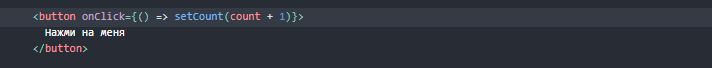
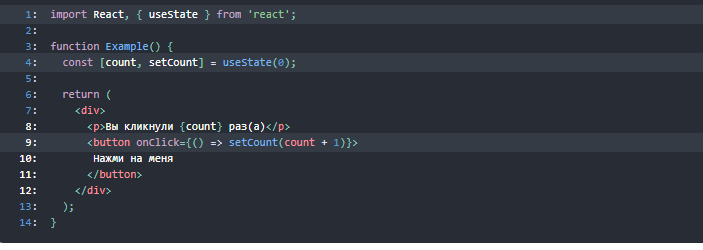
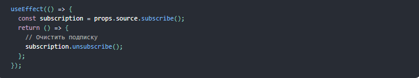

# week2day2
# Использование хука состояния
Хуки — нововведение в React 16.8, которое позволяет использовать состояние и другие возможности React без написания классов.

На странице введения в хуки мы познакомились с ними на этом примере:

# Что такое хук?
 Хук — это специальная функция, которая позволяет «подцепиться» к возможностям React. Например, хук useState предоставляет функциональным компонентам доступ к состоянию React. Мы узнаем про другие хуки чуть позже.

# Когда применить хук? 
Раньше, если вы писали функциональный компонент и осознавали, что вам нужно наделить его состоянием, вам приходилось превращать этот компонент в класс. Теперь же вы можете использовать хук внутри существующего функционального компонента. Мы покажем это прямо сейчас!

# 
Обновление состояния
В классе мы вызываем this.setState(), когда надо обновить состояние count:

# Резюме
Давайте построчно пробежимся по тому, что мы выучили и проверим наши знания:

Строка 1: Импортируем хук useState из React. Он позволяет функциональному компоненту хранить внутреннее состояние.
Строка 4: Объявляем внутри компонента Example новую переменную состояния, вызвав хук useState. Этот вызов возвращает пару значений, которым мы даём имена. Поскольку наша переменная состояния хранит количество сделанных по кнопке кликов, мы называем её count. Чтобы проинициализировать её, мы передаём значение 0 в качестве единственного аргумента функции useState. Второе возвращённое нам значение позволяет обновлять count, поэтому мы называем её setCount.
Строка 9: Когда пользователь кликает по кнопке, мы вызываем setCount с приращённым значением. После этого React сделает повторный рендер, в котором использует уже новое значение count.
Поначалу это всё может показаться слишком сложным. Не торопитесь! Если вы запутались в объяснении, ещё раз прочитайте приведённый код с начала до конца. Обещаем, если вы на минутку «забудете», как состояние работает в классах, и посмотрите на код свежим взглядом, всё станет ясно.

# UseEffect
Принимает функцию, которая содержит императивный код, возможно, с эффектами.

Мутации, подписки, таймеры, логирование и другие побочные эффекты не допускаются внутри основного тела функционального компонента (называемого этапом рендеринга React). Это приведёт к запутанным ошибкам и несоответствиям в пользовательском интерфейсе.

Вместо этого используйте useEffect. Функция, переданная в useEffect, будет запущена после того, как рендер будет зафиксирован на экране. Думайте об эффектах как о лазейке из чисто функционального мира React в мир императивов.

По умолчанию эффекты запускаются после каждого завершённого рендеринга, но вы можете решить запускать их только при изменении определённых значений.

